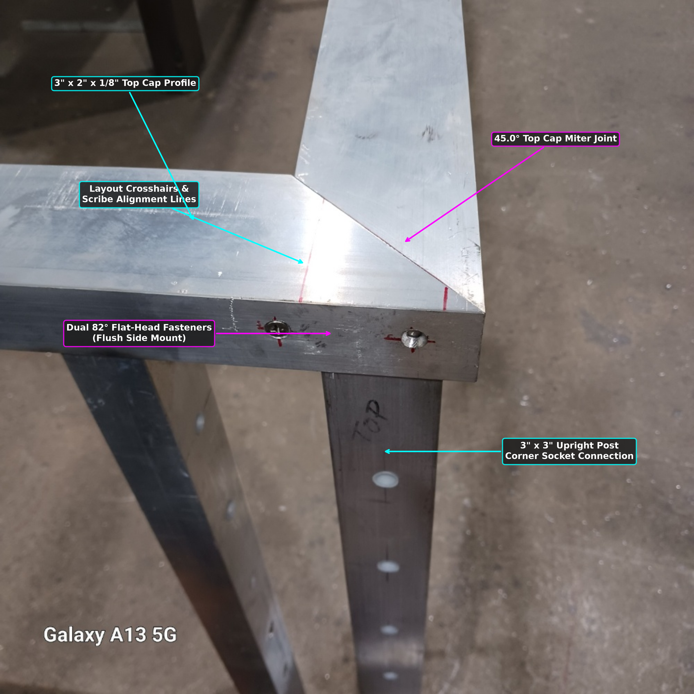

# Aluminum Handrail Generator

> **Parametric CAD generator and automated spec annotation tool for custom aluminum handrails and shop fabrication drawings.**

---

  

---

## About The Project

**aluminum-handrail-generator** is an automated engineering and fabrication pipeline designed to programmatically build, export, and annotate 3D CAD models for custom aluminum handrail frames. 

By combining Python automation with parametric CAD design, this project bridges the gap between digital modeling and real-world shop fabrication—generating exact 3D models, STEP files, and visual weld/inspection specs automatically for shop floor use.

### Key Capabilities

* **Parametric CAD Assembly:** Programmatically builds custom aluminum handrail assemblies (`HandrailBuilder.py`) and exports standard `.FCStd` (FreeCAD) and `.step` 3D model formats.
* **Automated Spec & Weld Callouts:** Generates high-resolution annotated shop specs (`annotate_frame_corner.py`), weld inspection callouts, and frame corner detail views (`weld_inspection_spec.png`, `handrail_corner_spec.png`).
* **Fabrication-Ready Outputs:** Produces clear visual documentation directly from CAD models to streamline material layout, fit-up, and welding on the shop floor.
* **Automated CI Validation:** Enforces code quality and execution testing through dedicated GitHub Actions workflows (`dev-branch` and `main` pipelines) to ensure drawing scripts run error-free.

---

## Tech Stack

* **AI Copilot & Automation Partner:** Gemini Flash *(Pipeline architecture, script refactoring, & CI/CD workflow automation)*
* **Core Language:** Python 3.10
* **CAD & 3D Modeling:** FreeCAD Engine, STEP (`.step`) / FCStd (`.FCStd`) exports
* **Image & Spec Processing:** Matplotlib, Pillow (PIL)
* **Testing & Quality Assurance:** Pytest, Flake8, GitHub Actions CI/CD
